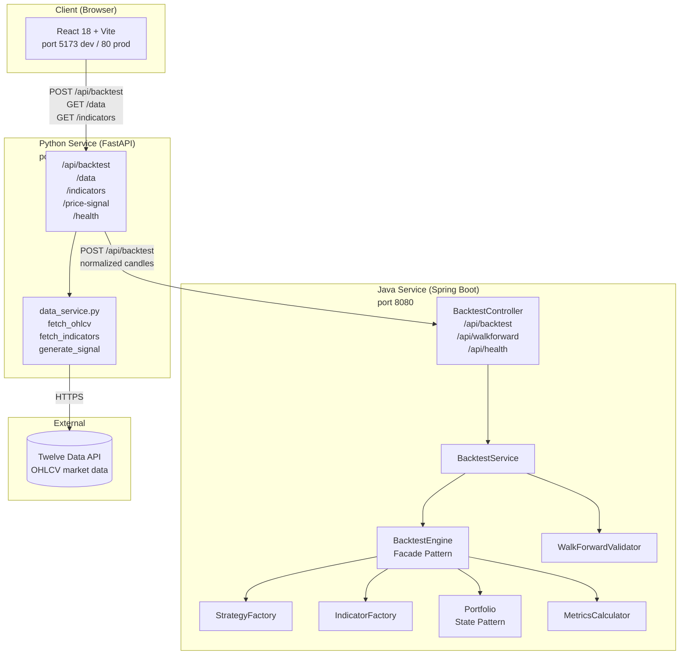
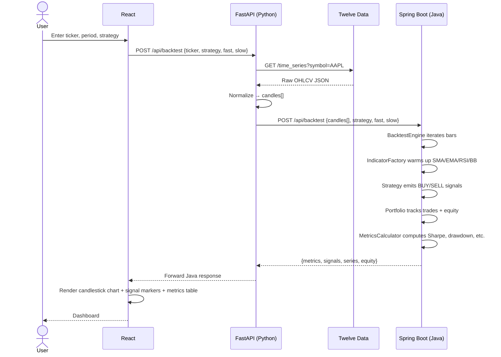
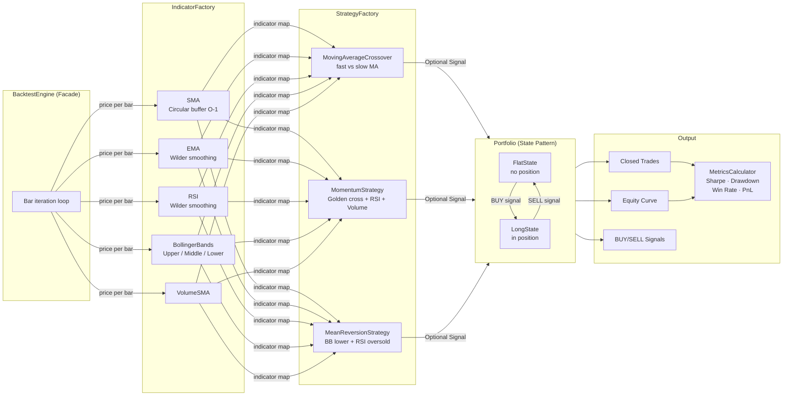
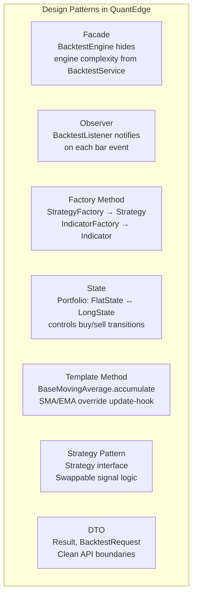
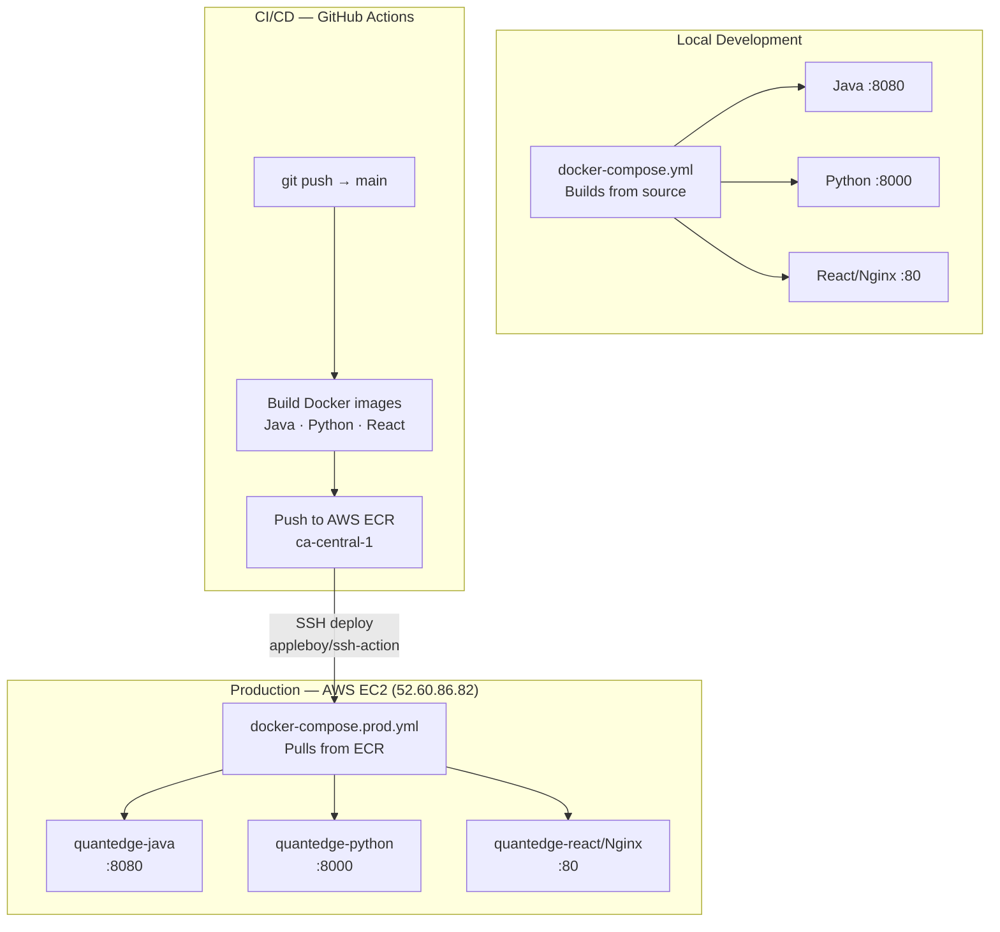

# QuantEdge System Design

## 1. High-Level Architecture



---

## 2. Request Flow — Backtest



---

## 3. Java Engine Internals



---

## 4. Design Patterns Used



---

## 5. Deployment Architecture



---

## 6. Test Coverage

```mermaid
graph LR
    subgraph JavaTests["Java Tests — 51 tests / JUnit 5"]
        T1[SMATest · 5]
        T2[EMATest · 5]
        T3[RSITest · 6]
        T4[MovingAverageCrossoverTest · 7]
        T5[MomentumStrategyTest · 8]
        T6[MeanReversionStrategyTest · 9]
        T7[MetricsCalculatorTest · 11]
    end

    subgraph PythonTests["Python Tests — 20 passes / pytest + anyio"]
        P1[/health shape]
        P2[/api/backtest validation × 4]
        P3[Happy path — mocked Java]
        P4[502 — Java unreachable]
        P5[/data shape + error propagation]
    end
```
